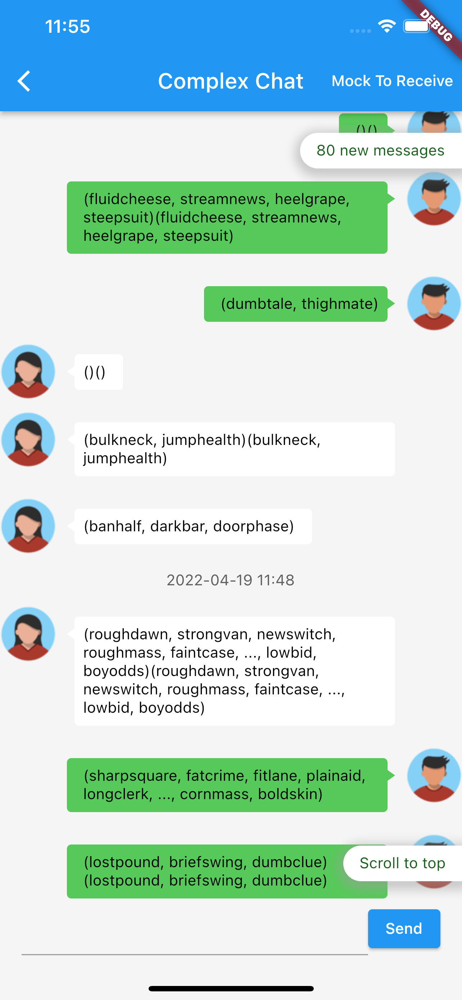
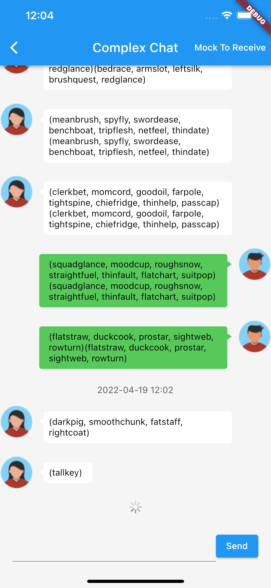

## Chat List

Chat list library is based on flutter list view library to implement full chat list functionality.

## Features

1. Support loading more and loading previous messages.
2. Support keeping scroll position when user scroll to other position to read messages.  
3. Support scrolling to unread message.
4. Support detecting receive message and tip new received messages
5. Support timetag in messages
6. Support load fragment messages and infine load prev messages

## Screen
|  |  |
| :-----:| :----: |
|  |  |


## Example
```dart
Widget _renderList() {
  return ChatList(
    msgCount: messages?.length ?? 0,
    itemBuilder: (BuildContext context, int index) => _renderItem(index),
    onMsgKey: (int index) => messages![index].id,
    controller: chatListController,
    // New message tip
    showReceivedMsgButton: true,
    onIsReceiveMessage: (int i) => messages![i].type == MsgType.receive,

    // Scroll to top
    showScrollToTopButton: true,
  );
}
```
More complex example
```dart
Widget _renderList() {
  return ChatList(
    msgCount: messages?.length ?? 0,
    itemBuilder: (BuildContext context, int index) => _renderItem(index),
    onMsgKey: (int index) => messages![index].id,
    controller: chatListController,
    // New message tip
    showReceivedMsgButton: true,
    receivedMsgButtonPosition: const Position(right: 0, bottom: 20),
    // newMessageComingButtonBuilder: defaultNewMessageComingButtonBuilder,
    onIsReceiveMessage: (int i) => messages![i].type == MsgType.receive,

    // Scroll to top
    showScrollToTopButton: true,
    offsetToShowScrollToTop: 400.0,
    // scrollToTopBuilder: defaultScrollToTopBuilder,
    onLoadTopMsgs: _loadTopMessagesWhenJumpToTop,

    // Last read message
    showUnreadMsgButton: true,
    latestReadMsgKey: latestMessageKey,
    unreadMsgCount: unreadMsgCount,
    unreadMsgButtonPosition: const Position(right: 0, top: 20),
    onLoadMsgsByLatestReadMsgKey: _loadMoreMessagesWhileMissLatestMsg,
    offsetFromUnreadTipToTop: 50,
    // lastReadMessageButtonBuilder: defaultLastReadMessageButtonBuilder,

    // Refresh
    hasPrevMsgs: hasPrevMessages,
    offsetToTriggerLoadPrev: 100,
    loadPrevProgressBuilder: defaultLoadPrevProgressBuilder,
    onLoadPrevMsgs: _loadPrevMessages,

    // Load more
    hasMoreMsgs: hasMoreMessages,
    offsetToTriggerLoadMore: 10,
    loadMoreProgressBuilder: defaultLoadMoreProgressBuilder,
    onLoadMoreMsgs: _loadMoreMessages,
  );
}
```